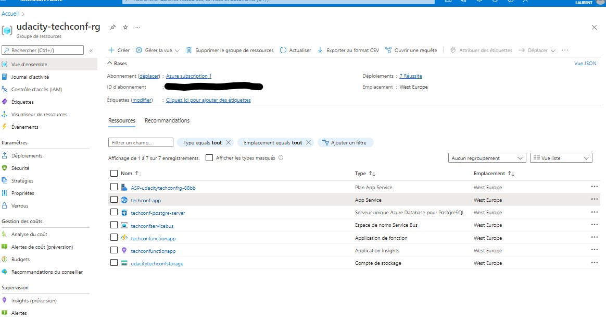

# TechConf Registration Website

This project is part of Udacity Cloud Developer on Azure Nanodegree. It can be found [here](https://github.com/udacity/nd081-c3-Migrating-Non-Native-Cloud-Applications-project-starter).
It is the third keystone project of the Nanodegree.

## Project Overview

The TechConf website allows attendees to register for an upcoming conference. Administrators can also view the list of attendees and notify all attendees via a personalized email message.

The application is currently working but the following pain points have triggered the need for migration to Azure:
 - The web application is not scalable to handle user load at peak
 - When the admin sends out notifications, it's currently taking a long time because it's looping through all attendees, resulting in some HTTP timeout exceptions
 - The current architecture is not cost-effective 

In this project, the objectives are to:
- Migrate and deploy the pre-existing web app to an Azure App Service
- Migrate a PostgreSQL database backup to an Azure Postgres database instance
- Refactor the notification logic to an Azure Function via a service bus queue message

## Dependencies

- [Postgres](https://www.postgresql.org/download/)
- [Visual Studio Code](https://code.visualstudio.com/download)
- [Azure Function tools V3](https://docs.microsoft.com/en-us/azure/azure-functions/functions-run-local?tabs=windows%2Ccsharp%2Cbash#install-the-azure-functions-core-tools)
- [Azure CLI](https://docs.microsoft.com/en-us/cli/azure/install-azure-cli?view=azure-cli-latest)
- [Azure Tools for Visual Studio Code](https://marketplace.visualstudio.com/items?itemName=ms-vscode.vscode-node-azure-pack)

warning note indicated by Udacity: the python package psycopg2 does not work directly in Azure; install `psycopg2-binary` instead to use the psycopg2 library in Azure

## Project Steps

### Part 1: Create Azure Resources and Deploy Web App
### Part 2: Create and Publish Azure Function triggered by the service bus queue

The Azure Function should do the following:
- Process the message which is the `notification_id`
- Query the database using `psycopg2` library for the given notification to retrieve the subject and message
- Query the database to retrieve a list of attendees (**email** and **first name**)
- Loop through each attendee and send a personalized subject message
- After the notification, update the notification status with the total number of attendees notified

### Part 3: Refactor `routes.py`
Refactor the post logic in `web/app/routes.py -> notification()` using servicebus `queue_client`:
   - The notification method on POST should save the notification object and queue the notification id for the function to pick it up

## Monthly Cost Analysis
Cost analysis of each Azure resource providing an estimate total cost:

| Azure Resource              | Service Tier         | Monthly Cost |
| ----------------------------| -------------------- | ------------ |
| *Azure Postgres Database*   | Basic,1vCore(s),5 Go |  $29.65      |
| *Azure Service Bus*         |      Basic           |   $0.05*     | 
| *Azure WebApp*              |      S1              |  $69.35**    | 
| *Azure Function*            |  Consumption plan    |     ***      | 
| *Azure Storage*             |  Linked to Function  | negligeable  |
| **TOTAL**                   |                      |**$99.05**    |
|_____________________________|______________________|______________|
- * per million operations per month unlikely to be exceeded
- ** I use a F1 but such app might use a production plan - Start with S1 estimated here
- *** Only pay what I use based on number of executions, length of execution and memory used - Free in year 1
- **** Storage used by the function to store operation information - negligeable amount of data

This can also be evaluated using the convenient **Azure Pricing calculator tool** available [here](https://azure.microsoft.com/en-in/pricing/calculator/).

## Architecture Explanation
Reasoning behind the architecture selection for both the Azure Web App and Azure Function.
- Web app
the web ap is unlikely to require more than 14Gb of memory and 4 CPUs. The webapp S1 plan appears more practical than a Virtual Machine which would reequire significant administration
Given the type of business, the traffic will remain quite low compared to ecommerce or BtoC businesses with a very large customer base
For conference registration needs, the fully managed webapp service will simplify a lot the operations vs previous situation. This should be a very cost effective solution
- Azure Function
The azure function will operate in the background, off-loading the webapp with the task to process and send notification emails to participants. This tasks does not require to be executed with immediate effect and is a perfect candidate for a background job. Thanks to the consumption plan, the function will use its own resources and will rely on the webapp resources 
The main benefits: It allows the task to securly run in the background and be scalable thanks to the consumption plan. The execution will improve compared to the looping and will eliminate all http timout 

## Output

- Resources implemented

- Front end app

- Email notifications using SendGrid and PostGre db

